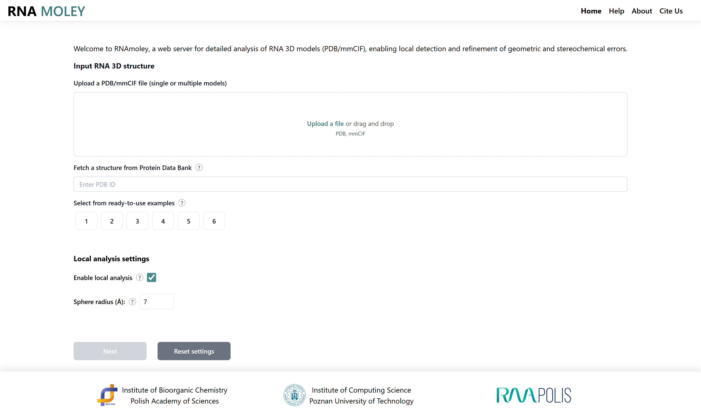
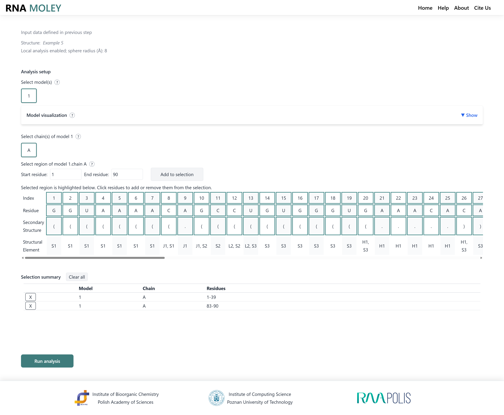
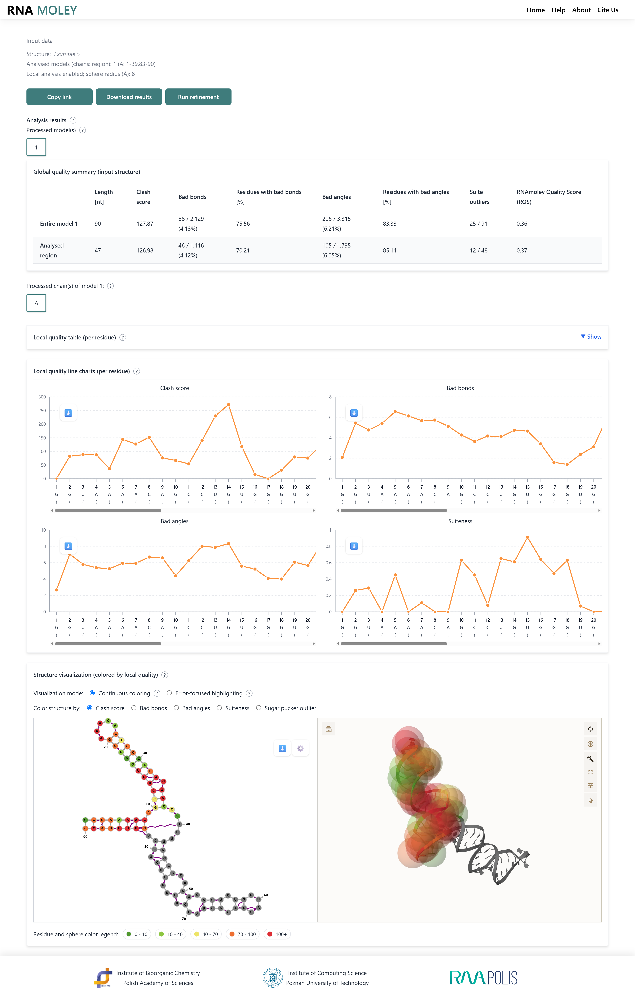

# RNAmoley

RNAmoley is a web-based tool for local quality assessment and targeted refinement of RNA 3D structures.

The application identifies structural problems at the local level and presents them through interactive 2D and 3D visualizations. Users can inspect problematic regions, perform structural refinement, and compare local quality before and after restrained energy minimization.

RNAmoley consists of a React-based web interface, a REST API, and other work components running in Docker containers.

## Features

* local quality assessment of RNA 3D structures,
* identification and spatial localization of structural anomalies,
* interactive 2D and 3D structure visualization,
* neighborhood-based analysis using a walking-sphere approach,
* targeted structural refinement through restrained energy minimization with NAMD,
* comparison of local quality before and after refinement,
* example structures and precomputed results included with the repository.

## Input

RNAmoley accepts RNA 3D structures in **PDB and mmCIF format,** as well as **PDB ID**.

After loading a structure, the user is asked to select region of structure. Then, the application performs local structural quality analysis and allows the user to inspect detected issues directly in the molecular model and accompanying plots.

## Workflow

A typical RNAmoley workflow consists of three steps:

1. **Structure analysis**
   Upload an RNA structure.

2. **Region selection**
   Select a region of the molecule that should be analysed.

3. **Analysis and refinement**
   Analyse the results, run restrained energy minimization for the selected region and compare the resulting local quality with the original structure.

## Output

RNAmoley provides an interactive analysis of the submitted RNA structure, including:

* local quality scores mapped onto the RNA structure,
* interactive plots showing the distribution of local structural quality,
* 2D and 3D visualization of problematic regions,
* structural information associated with detected local anomalies,
* a refined RNA model after targeted energy minimization,
* direct comparison of local quality before and after refinement.

For refinement runs, the original and refined structures can be inspected side by side through the application's visualization and quality-analysis components.

Precomputed example results are provided together with the demo structures in:

```text
restapi/demo_files
```

## Interface preview

### Input and structure analysis

Upload an RNA 3D structure and configure the analysis.



### Region selection

Inspect local structural quality and select a region for targeted refinement.



### Refinement results

Compare local quality before and after refinement and inspect the resulting structure.



## Requirements

Before starting RNAmoley, make sure that the following are available:

* Docker,
* Docker Compose,
* NAMD,
* VMD.

NAMD and VMD are not distributed with this repository and must be obtained separately from their official sources.

The currently recommended versions are:

* `NAMD_3.0.2_Linux-x86_64-multicore`
* `vmd-1.9.3.bin.LINUXAMD64.text`

## Setup

### 1. Configure the REST API

Create the environment configuration for the REST API using the provided example file:

```bash
cp restapi/.env.example restapi/.env
```

Adjust the values in `.env` if necessary for your environment.

### 2. Provide NAMD and VMD

Download the NAMD and VMD archives from their official distribution websites and place them in the `sim` directory.

The expected archives correspond to the versions listed above unless the Docker configuration is adjusted accordingly.

### 3. Start RNAmoley

Build and start all services with Docker Compose:

```bash
docker compose up --build
```

After the containers have started successfully, the web interface is available at:

```text
http://localhost:3000
```

## References

RNAmoley uses structural templates, reference data, and molecular mechanics components derived from the following resources.

### NtC templates

1. J. Černý, M. Malý, P. Božíková, T. Prchalová, J. Svoboda, L. Biedermannová, B. Schneider.
   **Dnatco v5.0: integrated web platform for 3D nucleic acid structure analysis.**
   *Nucleic Acids Research* 54 (2026), gkaf1491.
   https://doi.org/10.1093/nar/gkaf149

### Base-pair templates

1. X.-J. Lu, H. J. Bussemaker, W. K. Olson.
   **DSSR: an integrated software tool for dissecting the spatial structure of RNA.**
   *Nucleic Acids Research* 43 (2015), e142.
   https://doi.org/10.1093/nar/gkv716

2. C. L. Lawson, H. M. Berman, B. Vallat, L. Chen, C. L. Zirbel.
   **The Nucleic Acid Knowledgebase: a new portal for 3D structural information about nucleic acids.**
   *Nucleic Acids Research* 52 (2024), D245–D254.
   https://doi.org/10.1093/nar/gkad957

### AMBER force fields in NAMD

1. S. Antolínez, P. E. Jones, J. C. Phillips, J. A. Hadden-Perilla.
   **AMBERff at Scale: Multimillion-Atom Simulations with AMBER Force Fields in NAMD.**
   *Journal of Chemical Information and Modeling* 64(2) (2024), 543–554.
   https://doi.org/10.1021/acs.jcim.3c01648

## Web server

A public instance of RNAmoley is available at:

https://rnamoley.cs.put.poznan.pl/
